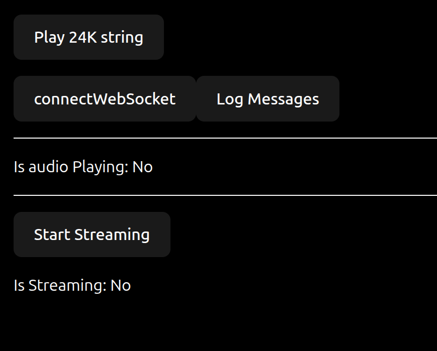

# gemini-live-audio-project:

- YouTube: https://www.youtube.com/watch?v=o9jtJL81jf0

### How to use:



```bash
git clone https://github.com/OmarThinks/gemini-live-audio-project
```

Navigate to `v3/express-project`, and create a `.env` file, and put your Gemini API key like this:

```bash
GOOGLE_API_KEY=""
```

Then run the backend like this:

```bash
cd v3/express-project
npm start
```

And in another terminal tab, run the vite project:

```bash
cd v3/vite-project
npm run dev
```
